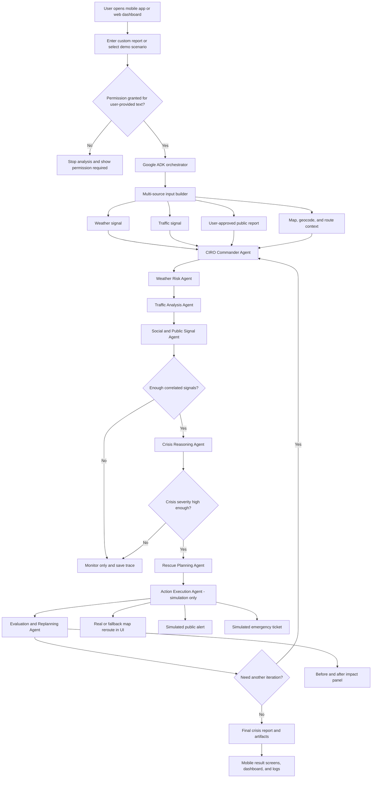

# CIRO - Crisis Intelligence & Response Orchestrator

Agentic crisis intelligence for turning noisy emergency signals into explainable response decisions, simulated map reroutes, alerts, tickets, and before/after impact.

Hackathon: Google Antigravity / AISeekho2026  
Challenge: Crisis Intelligence & Response Orchestrator  
Status: Working hackathon prototype, simulation-only

CIRO is not a real emergency dispatch system. It does not contact real emergency authorities, send real public alerts, scrape private data, or dispatch responders.

## Quick Run Commands

Run these commands from `D:\Antigravity_Hackthon`.

### 1. Backend + Web Dashboard

```powershell
cd D:\Antigravity_Hackthon
.\.venv\Scripts\Activate.ps1
python -m uvicorn main:app --host 127.0.0.1 --port 8000 --reload
```

Open:

```text
http://127.0.0.1:8000
```

If `.venv` does not exist yet:

```powershell
cd D:\Antigravity_Hackthon
python -m venv .venv
.\.venv\Scripts\Activate.ps1
python -m pip install --upgrade pip
pip install -r requirements.txt
python -m uvicorn main:app --host 127.0.0.1 --port 8000 --reload
```

### 2. Mobile App - Expo

In a second terminal:

```powershell
cd D:\Antigravity_Hackthon\mobile\ciro_mobile
npm install
npx expo start
```

Then scan the QR code using Expo Go.

For Expo web preview:

```powershell
cd D:\Antigravity_Hackthon\mobile\ciro_mobile
npm install
npx expo start --web --port 8082
```

Open:

```text
http://127.0.0.1:8082
```

For Android emulator, the app should use:

```text
http://10.0.2.2:8000
```

For a real phone on the same Wi-Fi, set the backend URL inside the mobile app settings to your laptop IP, for example:

```text
http://192.168.1.10:8000
```

## Executive Summary

Metropolitan crisis response is often fragmented. Weather alerts, traffic disruption, social reports, and operator observations exist in separate places. CIRO demonstrates a safe agentic AI workflow that ingests these signals, detects a crisis, reasons about severity, plans coordinated actions, simulates execution, and visualizes outcome.

The system supports:

- Predefined crisis scenarios.
- Any user-entered crisis report with location and severity.
- Noisy English and Roman Urdu input.
- Real Google Maps rendering when `GOOGLE_MAPS_API_KEY` is available.
- Interactive OpenStreetMap-based UI fallback plus mock route/weather data if Google APIs fail.
- Agent trace logs and artifacts for judging.

## Workflow Diagram



## What CIRO Shows In The Demo

1. User submits a crisis signal, for example:

   ```text
   Peshawar Ring Road pe road block hai, traffic jam aur ambulance phansi hui hai
   ```

2. CIRO detects the crisis type and location.
3. Weather, traffic, route, and public report signals are combined.
4. Confidence and crisis level are calculated.
5. Agents plan simulated actions:
   - reroute traffic
   - dispatch emergency unit
   - send simulated alert
   - create simulated ticket
6. UI shows:
   - mobile-first results screen for the mandatory app deliverable
   - real Google map when available
   - interactive OpenStreetMap UI fallback when browser Google Maps is unavailable
   - tactical SVG fallback if external map tiles are unavailable
   - red blocked/original route
   - green alternate route
   - weather condition
   - action log
   - before/after impact
   - agent decisions and traces

## Challenge Requirement Mapping

| Requirement | CIRO Implementation |
|---|---|
| Multi-source input processing | User text, simulated weather, simulated traffic, route/map context, public report style signals. |
| Noisy language handling | Roman Urdu and English keyword extraction through Mini Assistant and signal watcher logic. |
| Event detection | Signal Watcher, Crisis Detector, Verification Agent. |
| Reasoning and situation analysis | Crisis Reasoning Agent calculates severity, confidence, affected roads, and risks. |
| Action planning | Rescue Planning Agent creates dispatch, reroute, alert, shelter/ticket plans. |
| Action simulation | Execution Agent simulates map update, alert, ticket, and state changes. |
| Outcome visualization | Dashboard/mobile summary, real or fallback map, logs, before/after metrics, artifacts. |
| Agentic workflow | Google ADK root agent plus deterministic 9-agent CIRO loop. |
| Mobile app | Mandatory Expo React Native app under `mobile/ciro_mobile`. |
| Web app | Optional FastAPI-served companion PWA dashboard under `dashboard/`. |

## Architecture

```text
Mobile App / Optional Web Dashboard
        |
        v
FastAPI API Gateway - main.py
        |
        +-- /api/iterative/run
        +-- /api/iterative/run-custom
        +-- /api/weather
        +-- /api/route
        +-- /api/artifacts
        |
        v
backend/iterative_pipeline.py
        |
        v
9-Agent CIRO Pipeline
        |
        +-- CIRO Commander
        +-- Weather Risk
        +-- Traffic Analysis
        +-- Social/Public Signal
        +-- Verification
        +-- Crisis Reasoning
        +-- Rescue Planning
        +-- Action Execution
        +-- Evaluation/Replanning
        |
        v
Artifacts + Map Route Trace + Weather Trace + Final Report
```

Google ADK integration:

```text
adk_ciro/agent.py       -> Google ADK root_agent
adk_ciro/tools.py       -> ADK tools wrapping CIRO backend functions
adk_ciro/run_adk_demo.py -> terminal proof of ADK-style orchestration
```

## Agents

| Agent | Responsibility |
|---|---|
| CIRO Commander Agent | Coordinates iteration lifecycle and shared state. |
| Weather Risk Agent | Evaluates rainfall, alert level, and weather contribution. |
| Traffic Analysis Agent | Detects congestion, blocked roads, and ambulance delay risk. |
| Social/Public Signal Agent | Reads only user-approved/public demo reports. |
| Verification Agent | Deduplicates and verifies correlated crisis signals. |
| Crisis Reasoning Agent | Determines crisis type, level, confidence, severity, affected roads. |
| Rescue Planning Agent | Builds coordinated simulated response plan. |
| Action Execution Agent | Simulates reroute, alert, ticket, and state changes. |
| Evaluation/Replanning Agent | Compares before/after impact and decides whether to re-plan. |

## Repository Structure

```text
.
|-- adk_ciro/                 # Google ADK root agent and tool wrappers
|-- backend/
|   |-- agents/               # Deterministic CIRO agents
|   |-- services/             # Google maps, artifacts, scenarios, Mini Assistant
|   |-- iterative_pipeline.py # Three-iteration agent loop
|   `-- schemas.py            # Pydantic domain models
|-- dashboard/                # Web dashboard and PWA assets
|-- mobile/ciro_mobile/       # Expo React Native mobile app
|-- artifacts/                # Generated traces, reports, and evidence
|-- main.py                   # FastAPI app
|-- requirements.txt
|-- .env.example
`-- README.md
```

## Environment Variables

Create `.env` from `.env.example`:

```powershell
Copy-Item .env.example .env
```

Example:

```env
GOOGLE_API_KEY=your_gemini_key_here
GOOGLE_MAPS_API_KEY=your_google_maps_key_here
GROQ_API_KEY=optional_groq_fallback_key_here
CIRO_GROQ_MODEL=openai/gpt-oss-120b
CIRO_ENV=development
```

Usage:

- `GOOGLE_API_KEY`: Gemini / Google ADK narration and tool orchestration demo.
- `GOOGLE_MAPS_API_KEY`: Maps JavaScript, geocoding, weather, and routes.
- `GROQ_API_KEY`: optional fallback narration only if Gemini fails, quota is exhausted, or narration should continue without blocking the deterministic crisis pipeline.
- `CIRO_GROQ_MODEL`: optional Groq model name.

> Groq fallback note: CIRO's core crisis detection, planning, simulation, artifacts, and UI do not depend on Groq. Groq is only used as a backup language-model narration path when Gemini is unavailable.

Do not commit `.env`.

## Google API Setup

Enable these APIs in Google Cloud:

- Maps JavaScript API
- Geocoding API
- Routes API
- Weather API
- Gemini API / Google AI Studio key

Recommended key security:

- Restrict browser key by HTTP referrer for deployed web app.
- Restrict server key by API and environment.
- Use separate keys for local demo and deployed app if possible.

If Google Maps or Weather APIs fail, CIRO stays functional using OpenStreetMap UI tiles where available plus mock fallback geometry and weather.

## Future Roadmap

The current prototype is simulation-only and reads only user-entered or demo-approved emergency text. In a future production direction, CIRO can add a permission-based background mini-agent series that works like a safe background signal collector:

- A user or authorized organization explicitly grants permission for selected public or owned sources.
- Mini background agents fetch crisis-relevant data from approved platforms such as Facebook, Instagram, X/Twitter, Telegram, and other public/community channels.
- The preprocessing layer extracts post text, Roman Urdu/English keywords, images, voice notes, and audio from video when permission and platform policy allow it.
- The system deduplicates signals, removes unrelated/private content, scores confidence, and passes only emergency-relevant evidence into the CIRO pipeline.
- CIRO can then recommend or simulate specific actions such as notifying rescue teams, ambulance services, fire brigade units, public alert channels, traffic rerouting, shelter preparation, and map updates.
- All future integrations must preserve consent, platform terms, audit logs, and human approval before any real-world notification or dispatch.

## API Endpoints

| Method | Endpoint | Purpose |
|---|---|---|
| GET | `/health` | Health check. |
| GET | `/api/config` | Frontend config and Maps key status. |
| GET | `/api/iterative/scenarios` | List demo scenarios. |
| POST | `/api/iterative/run` | Run predefined 3-iteration scenario. |
| POST | `/api/iterative/run-custom` | Run any user-entered approved scenario. |
| GET | `/api/weather?location=...` | Weather update. |
| GET | `/api/route?origin=...&destination=...&blocked_area=...` | Route and alternate route. |
| GET | `/api/artifacts` | List generated artifacts. |
| GET | `/api/artifacts/{filename}` | Read one generated artifact. |

## Demo Scenarios

Predefined:

- Islamabad G-10 urban flooding
- Peshawar Ring Road blast and blockage
- Ambulance stuck during rain and congestion

Custom:

- Any user-entered crisis report, with location and severity.
- Example Peshawar input:

```text
Peshawar Ring Road pe road block hai, traffic jam aur ambulance phansi hui hai
```

## Artifacts And Logs

Generated evidence is stored in `artifacts/`.

Important files:

| Artifact | Purpose |
|---|---|
| `scenario_input.json` | Latest scenario input. |
| `iteration_1_decision_trace.json` | First iteration decision trace. |
| `iteration_2_replan_trace.json` | Replanning trace. |
| `iteration_3_final_trace.json` | Final trace. |
| `risk_score.json` | Final risk and confidence summary. |
| `rescue_action_plan.md` | Simulated action plan. |
| `final_crisis_report.md` | Judge-facing final report. |
| `agent_tool_calls.json` | Tool call / agent trace. |
| `map_route_trace.json` | Map markers, blocked route, alternate route. |
| `weather_signal_trace.json` | Weather intelligence. |
| `google_api_trace.json` | Google API/fallback status trace. |
| `mini_assistant_signal.json` | Latest custom input extraction. |
| `custom_scenario_input.json` | Latest custom scenario. |
| `custom_iteration_trace.json` | Latest custom scenario trace. |

## Antigravity / ADK Usage

CIRO uses Google Antigravity/ADK as the orchestration proof layer:

- `adk_ciro/agent.py` defines the ADK root agent.
- `adk_ciro/tools.py` exposes deterministic CIRO backend functions as ADK tools.
- `adk_ciro/run_adk_demo.py` shows a terminal ADK-style execution trace.
- Gemini is primary for optional narration.
- Groq is used only as optional fallback narration if Gemini fails or quota is exhausted.

Run ADK demo:

```powershell
cd D:\Antigravity_Hackthon
.\.venv\Scripts\Activate.ps1
python adk_ciro\run_adk_demo.py
```

Skip narration:

```powershell
$env:CIRO_SKIP_NARRATION="1"
python adk_ciro\run_adk_demo.py
```

## Safety And Privacy

- Simulation only.
- No real emergency dispatch.
- No real public alerts.
- No real authority notification.
- No private message scraping.
- No background screen monitoring.
- User-provided text requires explicit permission.
- Logs and artifacts should not include secrets.

## Troubleshooting

| Issue | Fix |
|---|---|
| Web app not opening | Check backend terminal and open `http://127.0.0.1:8000`. |
| Port already in use | Use another port, for example `--port 8001`. |
| Mobile cannot reach backend | Use laptop LAN IP in mobile settings, e.g. `http://192.168.1.10:8000`. |
| Android emulator cannot reach backend | Use `http://10.0.2.2:8000`. |
| Real map not showing | Check `GOOGLE_MAPS_API_KEY`, Maps JavaScript API, and browser console. |
| Google API quota fails | CIRO uses fallback map/weather/route simulation. |
| Gemini quota fails | Core deterministic agents still run; Groq fallback can narrate only. |
| Stale PWA cache | Hard refresh or unregister service worker in browser DevTools. |

## Final Submission Checklist

- Mobile app link works.
- GitHub repo is accessible.
- Demo video is 3-5 minutes.
- Antigravity usage video is 2-3 minutes.
- README is current.
- `artifacts/` traces are zipped for Antigravity trace/log submission.
- `.env` and real API keys are not committed.
- Mobile app runs as the mandatory deliverable.
- Web dashboard runs as an optional companion demo.
- Custom Peshawar scenario works.
- Map reroute, weather, action log, ticket, and impact are visible.
- All shared links open in incognito/private browser.
